StarRocks集群运维工具

`1.1(2025.06.17) 新增配置文件，支持自定义修改连接元数据表`

`命令1: starrocks -s <app>`

查看全局统筹，其中包括集群核心参数、目前正在运行的语句、运行队列中的语句、BROKER LOAD正在运行的作业、ROUTINE LOAD正在运行的作业、资源隔离明细。

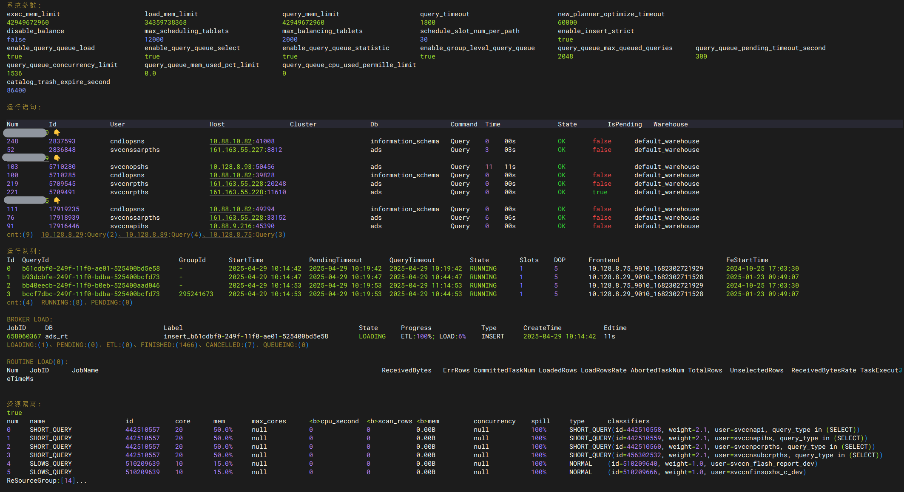

`命令2：starrocks -s <app> -l`

查看每个FE、BE/CN、BROKER节点的状态、存储、CPU缓存、克隆副本、字段线程、合并内存、CheckSum导入内存、进程内存、查询内存、结构变更、页面缓存、元数据、TcMalloc统计BE消耗、主键模型、总消耗等明细。

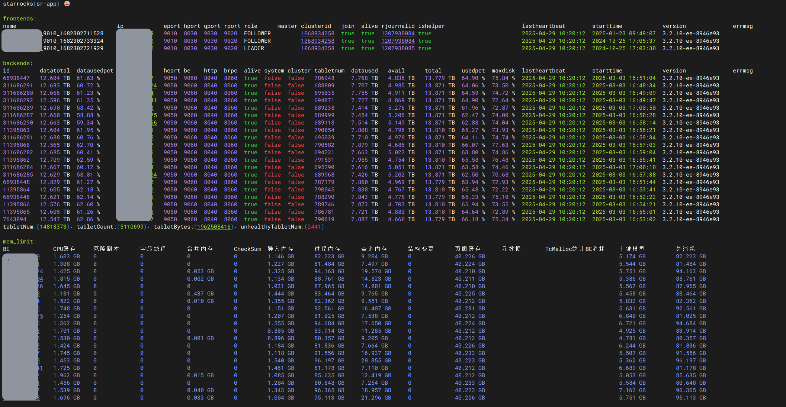

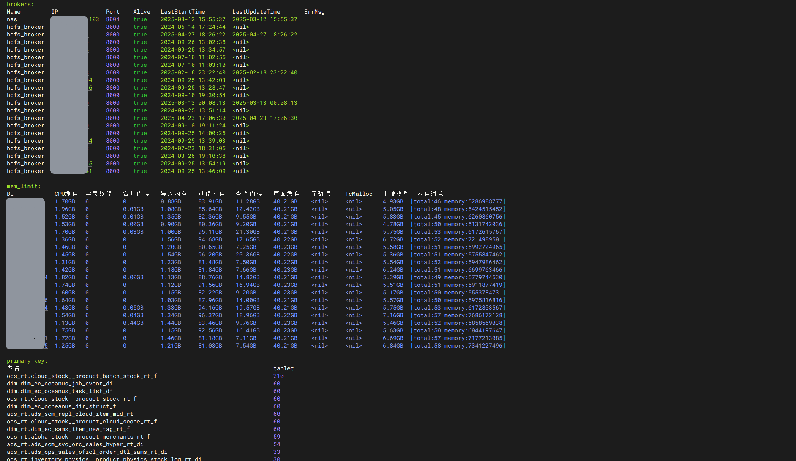

`命令3：starrocks -s <app> -front`

单独查看目前集群运行了什么语句

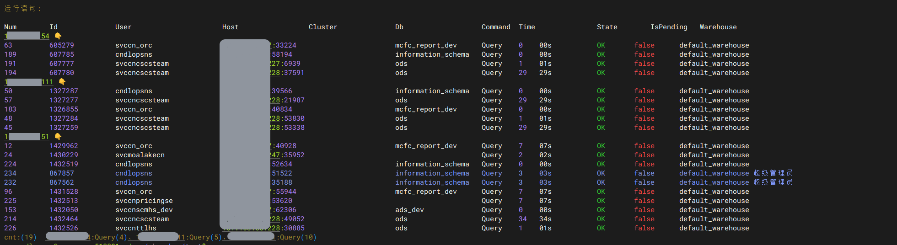

`命令4：starrocks -s <app> -p <connectionId>`

单独查看某个connectionId运行了什么语句

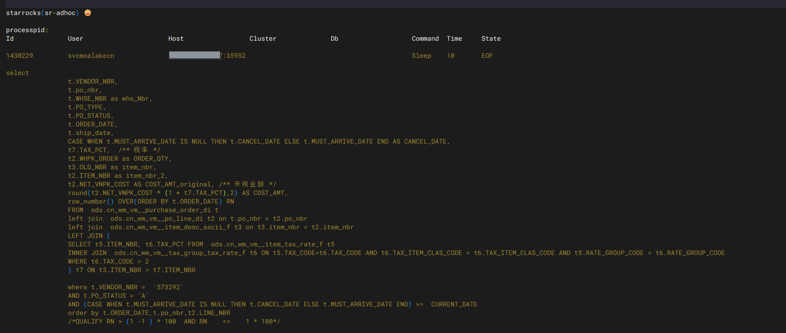

`命令5：starrocks -s <app> -p <connectionId> -k`

查杀这个某个connectionId语句

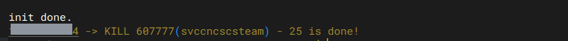

`命令6：starrocks -s <app> -key <关键字>`

根据关键字搜索整个集群中正在运行的语句。例如: 需要判断dim.dim_common_store_info_df表目前有没有被查询/执行, 关键字既可以填入dim.dim_common_store_info_df,如下所示，目前有两个用户在查这个表，可以使用命令4展示SQL语句。

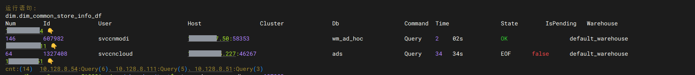

`命令7：starrocks -s <app> -alter`

查看目前正常执行alter操作的工作流，比如新增字段，修改分桶。

`命令8：starrocks -s <app> -c`

<mark>高级敏感</mark> ：清理整个集群中，目前正常运行的所有语句！

所有正在运行语句、包括sleep的连接，全部都会干掉！释放所有连接数。

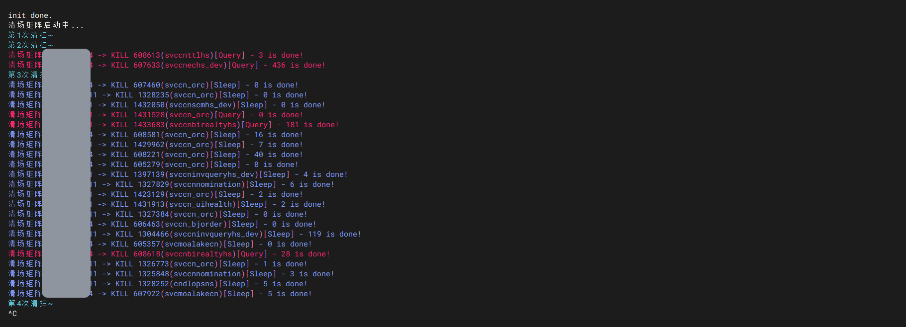

`命令9：starrocks -s <app> -io`

查看整个集群，每个BE中都运行了什么语句，包括语句类型，消耗内存，行数，CPU，表名，分区，用户。

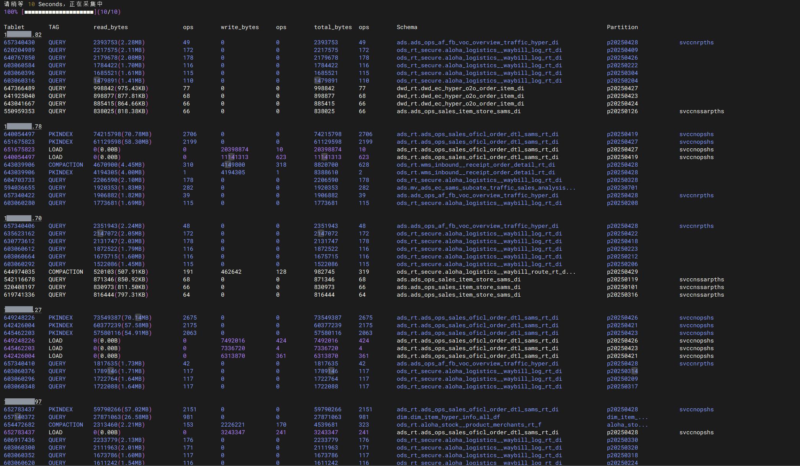

`命令10：starrocks -s <app> -io -ip <BE IP>`

查看整个集群，指定的某个BE中都运行了什么语句，包括语句类型，消耗内存，行数，CPU，表名，分区，用户。（一般用在IO高时，分析某个be运行了什么语句）

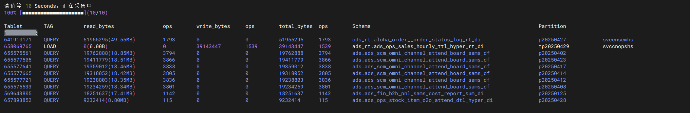

`命令11：starrocks -s <app> -e`

查看整个集群一个小时内，出现错误的query，指标：用户名，报错的queryid，报错信息

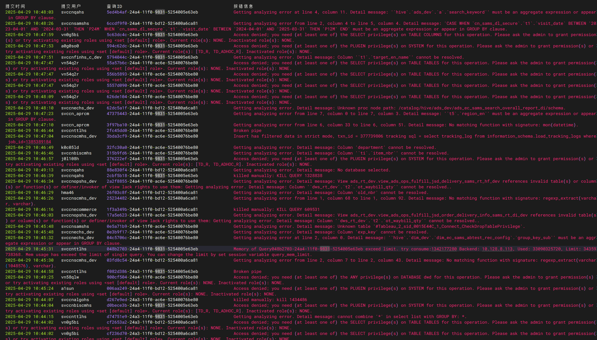

`命令12：starrocks -s <app> -status <state>`

查看整个集群中，目前正在运行的broker任务，状态包括PENDING|QUEUEING|LOADING|PREPARED|FINISHED|CANCELLED

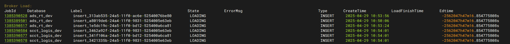

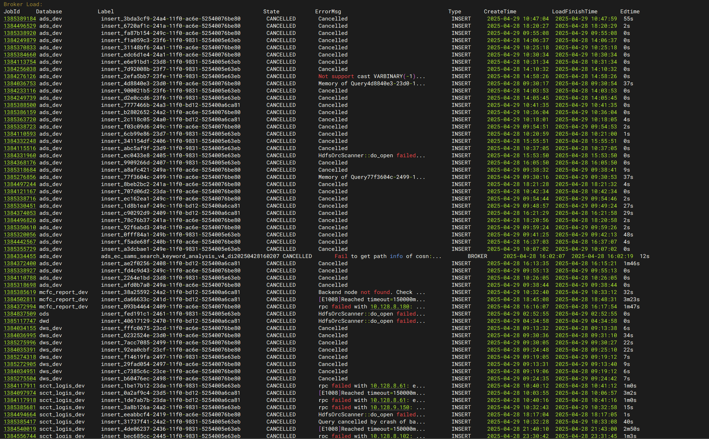

`命令12：starrocks -s <app> -jobid <id>`

查看集群中某个broker load作业的明细

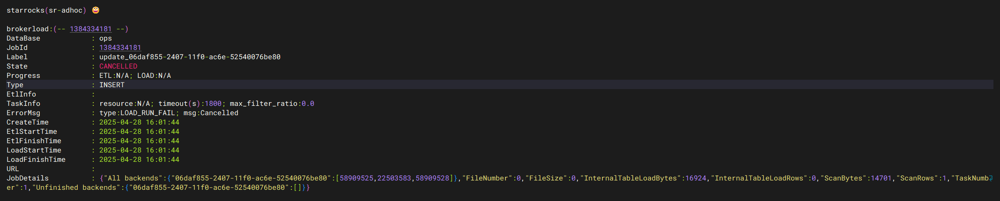

`命令13：starrocks -s <app> -u <username>`

查看集群中某个用户的所有连接，连接数

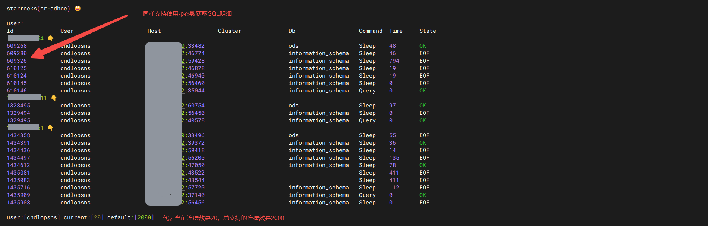

`命令14：starrocks -s <app> -q`

查看集群中，所有正在队列中运行的语句，指标包括提交时间，查询ID，连接ID，库名，用户名，消耗内存，扫描行数，IO，CPU执行时间等

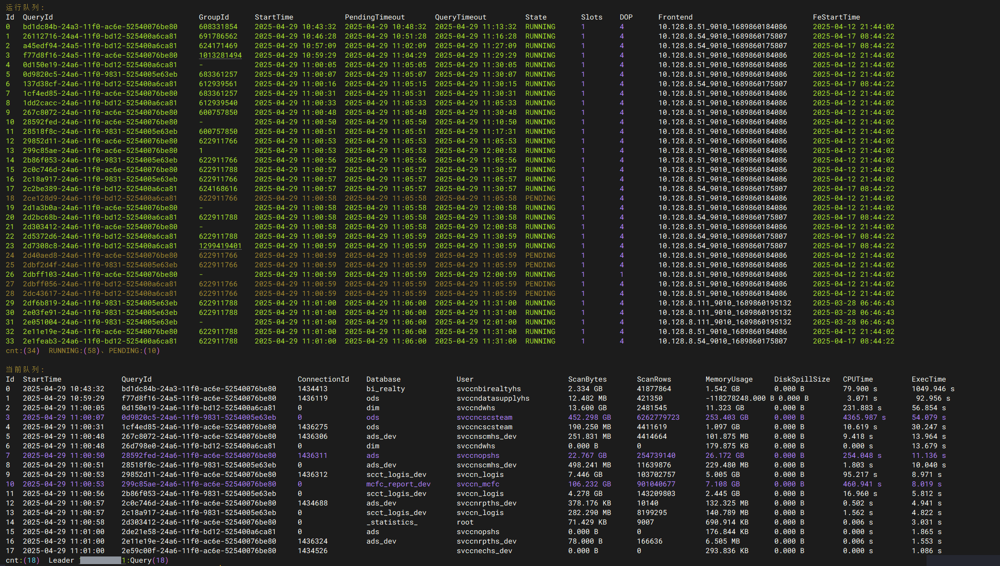

`命令15：starrocks -s <app> -q -id <queryId>`

查看集群中，某一个查询queryid目前在be上的资源消耗，其中包括内存，cpu

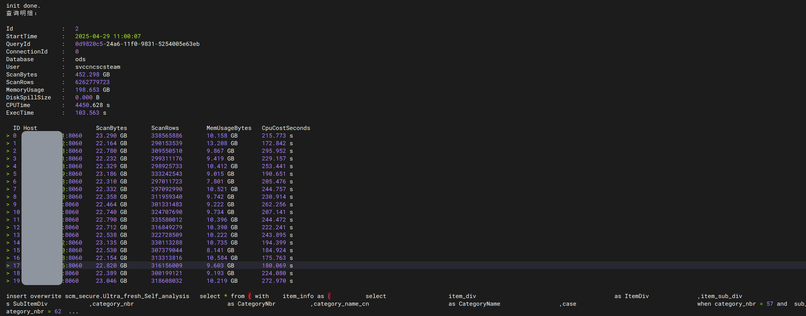

`命令15：starrocks -s <app> -v`

解析审计日志中，带有drop行为的所有语句（这个正常使用于，存在个别用户误删表，需要从回收站中恢复）这个审计日志我们集成了auditload,表名是audit.starrocks_audit_log

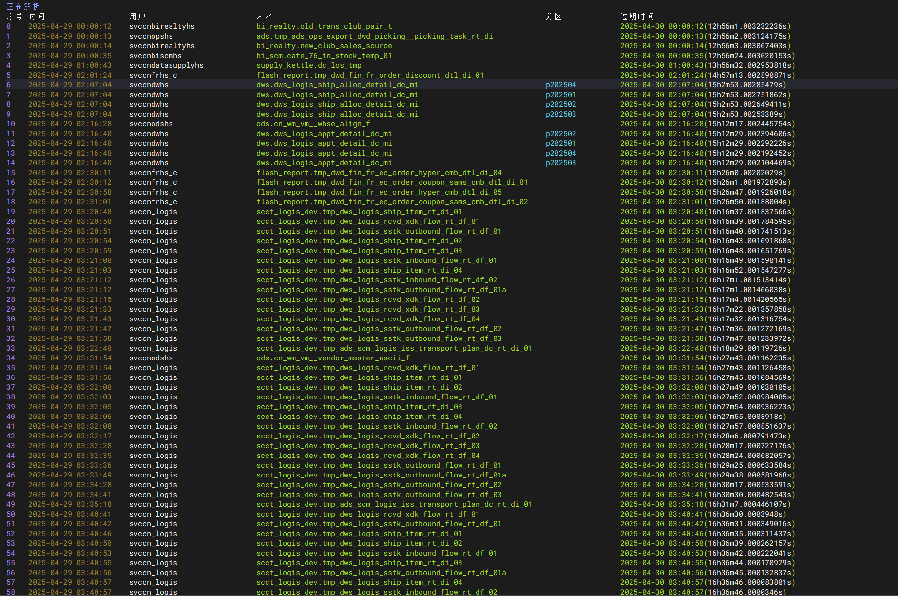

`命令16：starrocks -s <app> -d | -r | -pi`

从回收站中直接恢复被误删的某个表，分区等

`命令17：starrocks -s <app> license`

查看集群中的license(企业版)功能

`命令18：starrocks -s <app> -es`

查看集群中某个时间段的查询消耗（这从审计日志中取，里面嵌入了auditload审计表进行格式化）select * from audit.starrocks_audit_log where timestamp>='2025-04-29 10:58:59' and timestamp<'2025-04-29 11:08:59'  order by scanRows desc limit 20

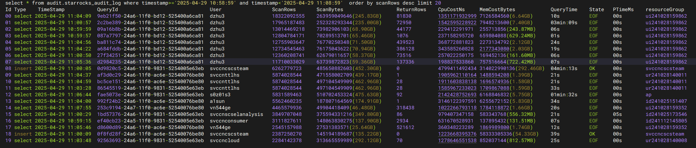

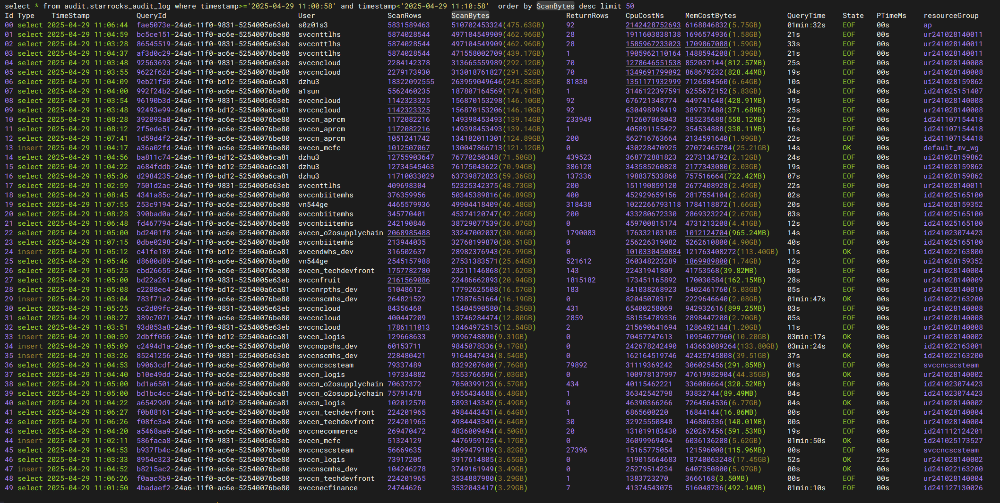

github: https://github.com/chengkenli/StarRocksDevops

配置：

程序全程属于golang，依赖了一个mysql表

`CREATE TABLE starrocks_information_connections (
  app varchar(100) CHARACTER SET utf8mb4 COLLATE utf8mb4_0900_ai_ci NOT NULL COMMENT '集群名称(英文)',
  nickname varchar(100) CHARACTER SET utf8mb4 COLLATE utf8mb4_0900_ai_ci DEFAULT NULL COMMENT '别名',
  alias varchar(100) CHARACTER SET utf8mb4 COLLATE utf8mb4_0900_ai_ci DEFAULT NULL COMMENT '集群别名',
  feip varchar(200) CHARACTER SET utf8mb4 COLLATE utf8mb4_0900_ai_ci NOT NULL COMMENT '集群连接地址(必填)F5,VIP,CLB,FE',
  user varchar(200) CHARACTER SET utf8mb4 COLLATE utf8mb4_0900_ai_ci NOT NULL COMMENT '集群登录账号(必填) 建议是管理员角色的账号',
  password varchar(500) CHARACTER SET utf8mb4 COLLATE utf8mb4_0900_ai_ci NOT NULL COMMENT '集群登录密码(必填)',
  feport int NOT NULL DEFAULT '9030' COMMENT '集群登录端口，默认9030',
  address varchar(500) CHARACTER SET utf8mb4 COLLATE utf8mb4_0900_ai_ci DEFAULT NULL COMMENT 'MANAGER地址，如果填了MANAGER地址，那么将触发定时检查LICENSE是否过期(企业级)',
  expire int DEFAULT '30' COMMENT 'LICENSE是否过期(企业级)过期提醒倒计时，单位day',
  status int NOT NULL DEFAULT '0' COMMENT 'LICENSE是否过期(企业级)开关,0 off, 1 on',
  fe_log_path varchar(500) CHARACTER SET utf8mb4 COLLATE utf8mb4_0900_ai_ci DEFAULT NULL COMMENT 'FE 日志目录',
  be_log_path varchar(500) CHARACTER SET utf8mb4 COLLATE utf8mb4_0900_ai_ci DEFAULT NULL COMMENT 'BE 日志目录',
  java_udf_path varchar(500) CHARACTER SET utf8mb4 COLLATE utf8mb4_0900_ai_ci DEFAULT NULL COMMENT 'BE 日志目录',
  manager_access_key varchar(500) DEFAULT NULL,
  manager_secret_key varchar(500) DEFAULT NULL,
  updated_at timestamp NULL DEFAULT CURRENT_TIMESTAMP ON UPDATE CURRENT_TIMESTAMP COMMENT '更新时间'
) ENGINE=InnoDB DEFAULT CHARSET=utf8mb4 COLLATE=utf8mb4_0900_ai_ci COMMENT='StarRocks登录配置，manager地址,(定期检查license过期日期)';`
